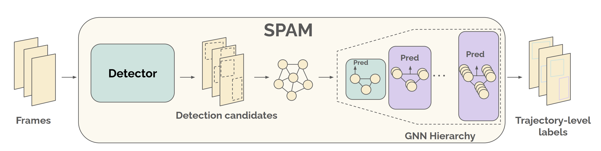
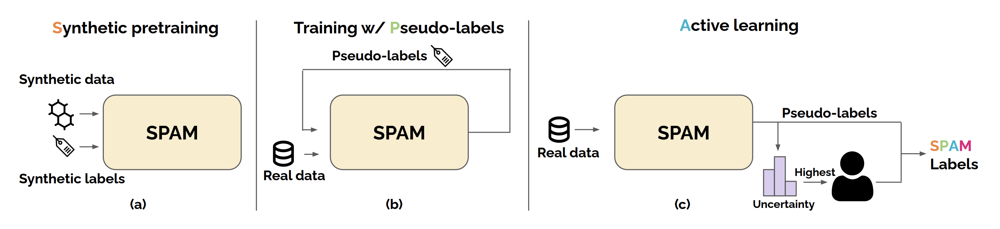

# SPAMming Labels: Efficient Annotations for the Trackers of Tomorrow

Official repository of our **ECCV 2024** paper 

> [**SPAMming Labels: Efficient Annotations for the Trackers of Tomorrow**](https://arxiv.org/pdf/2404.11426)
> 
> [Orcun Cetintas](https://dvl.in.tum.de/team/cetintas/), [Tim Meinhardt](https://research.nvidia.com/labs/dvl/author/tim-meinhardt/), [Guillem Brasó](https://dvl.in.tum.de/team/braso/), [Laura Leal-Taixe](https://research.nvidia.com/labs/dvl/author/laura-leal-taixe/)

Code and models are coming soon!

## Abstract
Increasing the annotation efficiency of trajectory annotations from videos has the potential to enable the next generation of data-hungry tracking algorithms to thrive on large scale datasets. Despite the importance of this task, there are currently very few works exploring how to efficiently label tracking datasets comprehensively. In this work, we introduce SPAM, a video label engine that provides high-quality labels with minimal human intervention. SPAM is built around two key insights: i) most tracking scenarios can be easily resolved. To take advantage of this, we utilize a pre-trained model to generate high-quality pseudo-labels, reserving human involvement for a smaller subset of more difficult instances; ii) handling the spatiotemporal dependencies of track annotations across time can be elegantly and efficiently formulated through graphs. Therefore, we use a unified graph formulation to address the annotation of both detections and identity association for tracks across time. Based on these insights, SPAM produces high-quality annotations with a fraction of ground truth labeling cost. We demonstrate that trackers trained on SPAM labels achieve comparable performance to those trained on human annotations while requiring only 3 − 20% of the human labeling effort. Hence, SPAM paves the way towards highly efficient labeling of large-scale tracking datasets.

**Overview of the SPAM model**: We first generate a set of detection candidates with our detector. Hierarchical GNNs then classify these candidates into valid and invalid objects via node classification, and assign identities through edge classification

**Overview of the SPAM training and annotation pipeline** (a) Initial model training on synthetic data. (b) Application of SPAM to generate pseudo-labels without incurring manual annotation costs on a real dataset, followed by self-training on pseudolabels. (c) Real dataset labeling using pseudo-labels and an uncertainty-based active learning approach.
